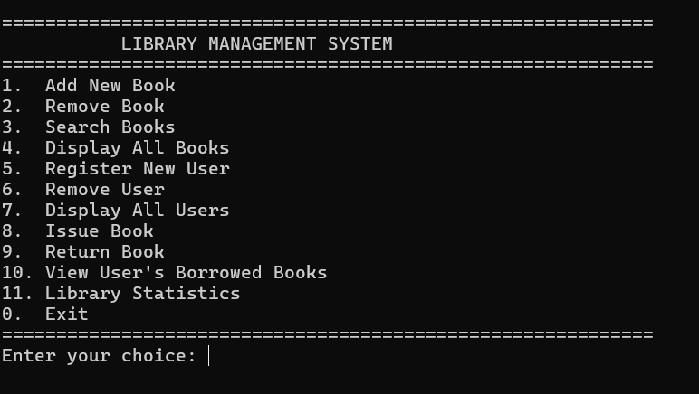

# Library Management System

  

A complete Library Management System implemented in C++ using Object-Oriented Programming principles with persistent binary file storage.

## Table of Contents
- [Features](#features)
- [OOP Concepts Implemented](#oop-concepts-implemented)
- [System Architecture](#system-architecture)
- [Installation](#installation)
- [Usage](#usage)
- [File Storage](#file-storage)
- [Modules](#modules)
- [Screenshots](#screenshots)
- [Technical Specifications](#technical-specifications)

## Features

### Book Management
- Add new books with complete details
- Remove books from the system
- Search books by title, author, or ID
- Display all available books
- Track total and available copies

### User Management
- Register new library users
- Remove user accounts
- Display all registered users
- View user borrowing history

### Transaction System
- Issue books to registered users
- Return books with date tracking
- Automatic fine calculation (₹2/day after 14 days)
- Borrowing limit enforcement (max 10 books/user)

### Data Persistence
- Automatic binary file storage
- Data preserved between sessions
- Two separate data files (books and users)
- Automatic file creation on first run

## OOP Concepts Implemented

| Concept          | Implementation Example                          |
|------------------|--------------------------------------------------|
| Encapsulation    | Private data members with public getters/setters |
| Inheritance      | DigitalBook class inheriting from Book base class |
| Polymorphism     | Virtual functions for dynamic method dispatch     |
| Abstraction      | Simplified interfaces for complex operations      |
| Composition      | Library class containing Books and Users          |

## System Architecture

```
Library Management System
├── Core Classes
│   ├── Book (Base Class)
│   │   └── DigitalBook (Derived Class)
│   ├── User
│   └── Library (Main Controller)
├── Data Storage
│   ├── books.dat (Binary file)
│   └── users.dat (Binary file)
└── UI Layer
    └── LibrarySystem (Menu Interface)
```

## Installation

### Prerequisites
- C++11 compatible compiler (g++ recommended)
- Standard C++ libraries
- Linux/Windows/Mac OS

### Compilation
```bash
g++ -std=c++11 LIBRARY_MANAGEMENT_SYSTEM.cpp -o library_system
```

### Execution
```bash
./library_system  # Linux/Mac
library_system.exe  # Windows
```

## Usage

### Starting the System
- The program automatically loads existing data or creates new data files.

### Main Menu Navigation
- Use the numbered menu system to access all features.

### Data Entry
- Follow on-screen prompts for adding books/users.

### Transactions
- Issue books through the dedicated menu
- Return books with automatic fine calculation

### Search Functionality
- Find books using flexible search queries.

## File Storage

The system uses two binary files for persistent storage:

### `books.dat`
- Stores all book records including:
  - Book IDs and titles
  - Author information
  - Copy availability status
  - Digital book specific data

### `users.dat`
- Stores all user records including:
  - User IDs and personal details
  - Borrowing history
  - Current book loans

> Note: These files are created automatically on first run.

## Modules

### Book Module
- Handles all book-related operations
- Supports physical and digital books
- Manages inventory and availability

### User Module
- Manages user registration
- Tracks borrowing history
- Enforces borrowing limits

### Transaction Module
- Processes book loans and returns
- Calculates overdue fines
- Maintains date records

### Storage Module
- Handles binary file I/O
- Provides data persistence
- Manages automatic saving

## Screenshots

<h3 align="center">Starting Panel</h3> <p align="center">  </p>
<h3 align="center">Add New Book</h3> <p align="center">  </p>
<h3 align="center">Display All Books</h3> <p align="center">  </p>
<h3 align="center">Search Books</h3> <p align="center">  </p>
<h3 align="center">Display All Users</h3> <p align="center">  </p>
<h3 align="center">Library Statistics</h3> <p align="center">  </p>

## Technical Specifications

- **Language:** C++11  
- **Storage:** Binary files (`books.dat`, `users.dat`)  
- **Data Structures:** Vectors for in-memory storage  
- **Date Handling:** System time with manual date parsing  
- **Error Handling:** Comprehensive input validation  
- **Platform:** Cross-platform (Windows/Linux/Mac)

## License

This project is licensed under the terms of the [MIT License](LICENSE).
